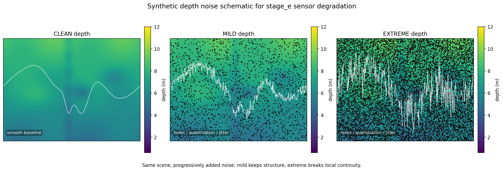

# images/ - 文档图片和示意图

本目录包含 ego-px4ctrl-new 文档中使用的所有图片和示意图。

## 📸 图片列表

### depth_noise_schematic.png
**用途**：传感器噪声模型示意图

这张图展示了**深度传感器噪声**的构成和影响：
- 高斯白噪声的叠加
- 离群点（outliers）
- 非线性失真

**在哪里使用**：
- [04_FEATURES/sensor_degradation_middleware_CN.md](../04_FEATURES/sensor_degradation_middleware_CN.md)

**何时查看**：
- 理解传感器噪声的构成
- 模拟真实传感器时需要的参考

---

### real_depth_reconstruction_schematic.png
**用途**：深度图像重构的原理示意

这张图展示了从**原始深度像素**到**3D 点云**转化的完整过程：
- 像素坐标 (u, v) 和深度值 d
- 相机内参投影矩阵
- 世界坐标系转换

**在哪里使用**：
- [04_FEATURES/vlm_bridge_usage_CN.md](../04_FEATURES/vlm_bridge_usage_CN.md)

**何时查看**：
- 理解相机模型和坐标系统
- VLM 视觉目标定位时的参考

---

### real_depth_reconstruction_shape.png
**用途**：深度重构的三维形状展示

这张图展示了一个真实物体的**深度图像重构效果**示例：
- 原始图像
- 深度图
- 重构后的 3D 点云
- 表面法向量

**在哪里使用**：
- [04_FEATURES/vlm_bridge_usage_CN.md](../04_FEATURES/vlm_bridge_usage_CN.md)

**何时查看**：
- 评估深度重构的质量
- 理解3D 感知的精度限制

---

## 🎨 如何添加新图片

如果你需要为文档增加新的图片：

1. **保存图片**：将图片保存到这个目录，使用清晰的英文名称（如 `sensor_architecture_diagram.png`）

2. **写简短说明**：在这个 README 中添加条目，说明图片的用途和出处

3. **在文档中引用**：在相关的 MD 文件中使用 Markdown 图片语法：
   ```markdown
   
   ```

4. **文件命名约定**：
   - 使用小写英文 + 下划线（如 `system_architecture.png`）
   - 简洁直观（`depth_noise_schematic.png` 比 `img_001.png` 好）

---

## 📋 图片清单

| 文件名 | 大小 | 格式 | 用途 | 关联文档 |
|--------|------|------|------|---------|
| depth_noise_schematic.png | ? | PNG | 传感器噪声模型 | sensor_degradation_middleware |
| real_depth_reconstruction_schematic.png | ? | PNG | 深度重构原理 | vlm_bridge_usage |
| real_depth_reconstruction_shape.png | ? | PNG | 3D 点云示例 | vlm_bridge_usage |

---

## 💡 关于图片的建议

- **保持简洁**：图片应该清晰传达核心思想，不要过于复杂
- **标注清楚**：使用清晰的中英文标签和箭头
- **高分辨率**：建议 1200×800 像素或以上（适合文档展示）
- **统一风格**：如果增加新图片，尽量与现有风格一致

---

**推荐返回**：[主文档索引](../00_DOCUMENTATION_INDEX.md)
